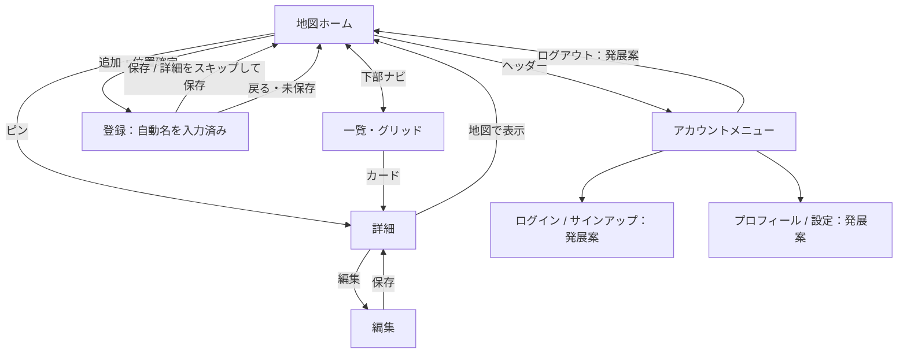

# Pin Note 要件・画面設計 v0.5

2026-09-12。課題条件とスマホ中心の希望を反映し、React＋TypeScript＋Vite / Java＋Spring Boot / PostgreSQLで初期版を実装。

## 現在の実装

- MUI Icons、Leaflet＋OpenStreetMapによる地図、現在地取得、地点選択、保存済みピン表示。
- 日時＋市区町村の自動名、詳細をスキップして保存、写真付き登録、一覧／格子表示、詳細・編集・削除。
- 市名補完はNominatim。未取得でも日時だけで保存。
- points / point_photosの2テーブル。既存授業機能用テーブルも維持。
- 写真は実装上JPEG／PNGに対応（WebPは未対応）。
- ユーザー名・パスワードによるサインアップ／ログイン／ログアウト、ユーザー名表示を実装済み。
- ポイント・写真・履歴は本人のみ参照・変更可能。直近10操作の取り消しを実装。
- フロントの画面切替は `/points/` 内で行う。下表の個別URLは設計案であり、独立したReactルートはまだ設けていない。
- 起動方法と確認結果は README.md / docs/verification.md を参照。

## 誰が使うか

散歩中に気になった場所をさっと残したい人。利用者グループはこの1つに絞る。入力を強制せず、場所だけ保存して後から見返せることを中心にする。

## 課題との対応・実装順

1. 最小版：PostgreSQLを使ったポイント登録・一覧表示。緯度経度と自動名を保存。名前・メモの手入力は不要。ブラウザー・利用端末・アプリ・DBの通常の再起動後も保存済みデータを保持する。
2. 地図体験：現在地取得、地図での位置選択、保存済みピン表示。地図配信への通信は必要になるため、外部API禁止ではなく「不要」という課題条件とは区別する。ネット接続のない発表でも登録・一覧を説明できる構成にする。
3. 追加機能：写真、一覧／2列グリッド切替、詳細・編集、市区町村名の自動取得。
4. 発展案：ログイン・サインアップ・プロフィール・設定。今回は画面案を用意するが、実認証を最小提出条件にしない。

課題は再起動でのリセットを許容するが、このアプリでは記録を残すことを必須とする。PostgreSQLへの接続とFlywayによるスキーマ管理を実装済み。DBはiCloud同期外のApplication Supportに保存する。

## DB案

既存構成はJava 17 / Spring Boot 3.5.14 / Thymeleaf / Spring Data JPA / H2。

採用DBはPostgreSQL。既存のインメモリH2から移行し、通常の永続テーブルへ記録する。DBはアプリ側で管理し、利用者のスマホ内には置かない。現状のH2はサーバー側Javaプロセス内のDBであり、スマホだけの再起動がDBリセットの直接原因ではない。

実装時はPostgreSQLドライバーと接続設定を追加し、接続情報は環境変数で渡す。DBのデータ領域は永続ディスクへ配置し、Dockerを使う場合も永続ボリュームを設定する。起動ごとにテーブルを作り直すddl-auto=create / create-dropは使わず、マイグレーションでスキーマを管理する。サンプルデータの初期化で利用者の記録を上書きしない。

受け入れ条件：ポイント登録後、ブラウザーの再読み込み、アプリの停止・再起動、DBの停止・再起動をそれぞれ行っても同じ記録を表示できる。写真対応後は画像も同様に確認する。DB停止中は保存成功と表示せず、入力を保持して再試行を案内する。

- points：id、title、latitude、longitude、municipality（NULL可）、memo（NULL可）、created_at、updated_at。
- point_photos（写真対応時）：id、point_id（外部キー）、image_data（bytea）、content_type、sort_order。
- points 1 : N point_photos。最小版1テーブル、写真対応で2テーブル。小規模版では画像もPostgreSQLに保存し、ポイントと同様に再起動後も保持する。画像が増える段階で別途画像ストレージを検討する。
- 写真は任意、初期上限3枚／地点・1枚5MB。JPEG/PNG/WebPを候補とし、サーバーで実データと容量を検証する。端末固有形式は対応可否を表示する。

## 登録の仕様

1. 地図上の追加ボタンから現在地取得、または地図で選んだ場所を使用。
2. 位置が確定したら登録画面を開く。日時＋市区町村名で名前を記入済みにする（例：2026/09/11 16:30 横浜市）。地図で選択した場合はその地点の市区町村を使う。
3. 名前は編集可能。メモ・写真は任意。名前を空にしても保存時に再生成する。
4. 「保存する」は入力した名前・メモ・写真を含めて保存。
5. 「詳細をスキップして保存」は位置＋自動名だけを保存。編集中の任意項目があるときは破棄の確認を出し、誤って消さない。
6. どちらも地図に戻り、新しいピンと保存完了を表示。「戻る」は登録せず地図に戻る。

市区町村名はGPS情報に含まれない。緯度経度から逆ジオコーディングで取得する必要がある。外部サービスを使わない最小版では「2026/09/11 16:30 のポイント」を自動名にする。市名取得対応後も、取得中・失敗・市名なしの場合は日時のみで保存を続行する。後から返った結果で利用者が編集した名前を上書きしない。日時は登録開始時の端末時刻（表示）、作成日時はサーバー側でも記録する。

位置取得拒否・タイムアウト時は地図選択へ誘導。位置未確定では保存不可。緯度-90〜90・経度-180〜180の有限値をサーバーで検証。連打中は保存ボタンを無効化し、失敗時は入力を保持。名前最大100文字、メモ最大1000文字。

## スマホ画面・ヘッダー

幅390pxを基準に320px以上へ対応。ロゴ＋アカウントボタンをヘッダーに置く。狭い画面で6項目を横並びにせず、ヘッダーのメニューにまとめる。

- 未ログイン：ログイン、サインアップ、設定。
- ログイン後：プロフィール、設定、ログアウト。
- モックでは表示状態の切替だけ。実際の認証・アカウント登録は行わない。

| 画面                   | 内容                                                | 優先度                   |
| ---------------------- | --------------------------------------------------- | ------------------------ |
| 地図ホーム /points     | 保存済みピン、現在地、＋追加、地図／一覧の下部ナビ  | 地図体験                 |
| 登録 /points/new       | 自動名、任意メモ・写真、保存、詳細スキップ保存      | 最小版                   |
| 一覧 /points/list      | 縦リストと2列グリッド切替。写真なしも成立するカード | 一覧は最小版、切替は追加 |
| 詳細 /points/{id}      | 名前、日時、写真、メモ、地図へ、編集                | 追加                     |
| 編集 /points/{id}/edit | 任意情報をあとから追加・修正                        | 追加                     |
| ログイン・サインアップ | メール／パスワード等の画面枠                        | 発展案                   |
| プロフィール・設定     | 表示名、テーマ等の画面枠                            | 発展案                   |

## 遷移

## デザイン

透明感のある青〜シアン、すりガラス風のヘッダーと下部ナビ、細い明るい境界、控えめな影。文字と入力面は読みやすい濃度を保つ。地図を主役にし、追加ボタンは右下。ピンは保存済み、現在地は点で区別。一覧は写真があればサムネイル、なければ位置アイコン。2列では長い名前を折り返す。操作領域は44px以上。

会話内モックは画面構成確認用。背景は地図のプレースホルダーで、番号ピンの位置はレイアウト例。実際の地理・GPS・市名取得・DB・認証とは接続していない。写真は選択画像の画面内プレビューのみ。

## 参照

- H2: https://h2database.com/html/features.html
- PostgreSQL構成: https://www.postgresql.org/docs/17/tutorial-arch.html
- 位置情報の項目: https://developer.mozilla.org/en-US/docs/Web/API/GeolocationCoordinates
- 逆ジオコーディング例（サービス未選定）: https://nominatim.org/release-docs/latest/api/Reverse/

## 2026-09-15 追加実装

ログインと所有者分離を初期版に追加。app_usersとpoint_historyを追加し、新アプリ本体は4テーブル（既存授業用は別に2つ）。履歴は1ポイントあたりではなく1利用者あたり直近10操作。登録・編集・削除を逆順に戻し、写真も復元する。Undo自体のやり直しは対象外。再起動後も履歴は保持。認証前のポイントは所有者が未確定のまま保管する。
